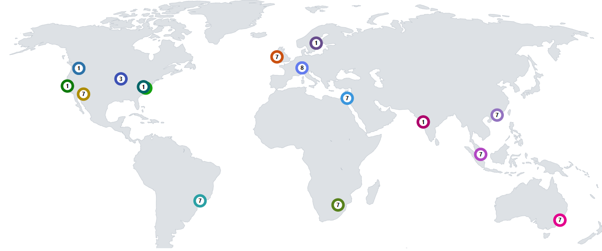
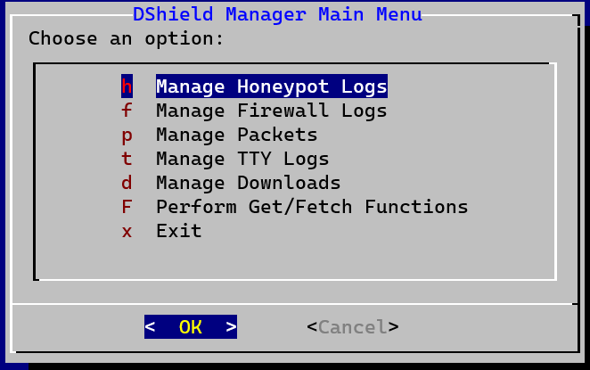
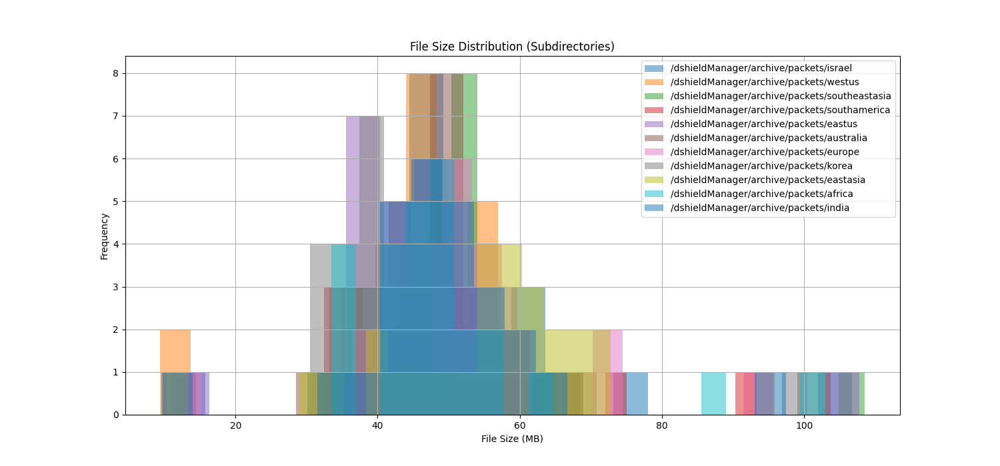
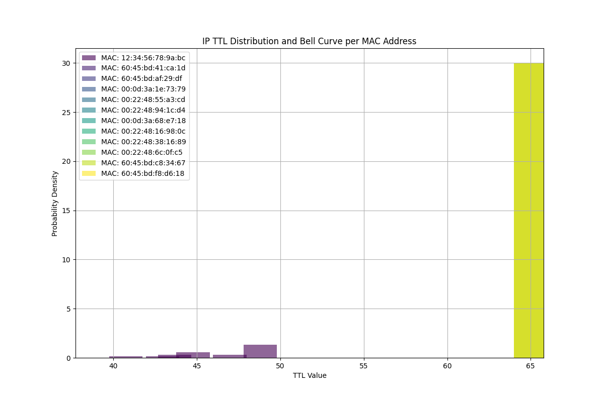

# DShieldManager
## Build and manage a global DShield Honeypot Network

  

<h3>Based on the SANS Internet Storm Center DShield Honeypot</h3>
Dr. Johannes Ullrich, Dean of Research at SANS, has maintained the Internet Storm Center DShield project for more than twenty years.  It's mature and extremely useful.

https://isc.sans.edu/tools/honeypot/ 
https://github.com/DShield-ISC/dshield

### In broad strokes:

The DShield Honeypot allows for collection of several types of attack data.
DShieldManager provides an interface into repetitive daily tasks associated with several of these data types.

1. Log collection and retention in a local archive.

2. A text menu interface to various functions.

3. Full packet capture, collection and retention in a local archive.

> As a bonus I include scripted deployment of Ubuntu hosts into Azure ready to install the DShield Honeypot.

2023-11-11 : I'm a dork.  I didn't realize someone has already done the heavy lifting on Terraform for DShield.  I'll be digging through https://github.com/DShield-ISC/dshield/blob/main/README_Terraform.md and streamlining this further in the near future.

*** Primary documentation for the phases of installation are being documented in <a href="docs/GETTING_STARTED.md">GETTING_STARTED.md</a>***.

The project began with scripting predicated upon a list of several manual processes.  In fact, more like a list of lists of processes.

I functionally decomposed them in successive rounds of coding into a funnel.  They became more and more code, and less and less manual. As I approach public beta relase, this will be whittled down to one or two manual actions to deploy all sensors.

### So, why?  Why bother with all of this?
What's the point of all of this?  Can't I just deploy a Honeypot in the cloud or on a Raspberry Pi at home, and examine my reporting over at https://isc.cans.org?

Yes.  You will absolutely continue with that behavior - in fact, we don't interrupt the original purpose of the DShield Honeypot in any significant way.  We're merely snatching and storing an ever increasing pile of logs, downloads, TTY sessions and packet captures from several distinct geographies.  Packet captures run somewhere around 100 megabytes per day and a 10 terabyte hard drive is cheap these days.  The full intent here is to collect far more data than we could with a single honeypot, from a wide range of sources, in hopes of capturing some truly interesting exploits as opposed to what we see hundreds of times per day.

Here's a quick walk-thru of the Beta on YouTube: 
https://www.youtube.com/embed/bzyu6Qn1ho4?si=ZyblaqS3ZD3_jSsC

> Oh, imagine that.  It's already outdated in terms of menu functions.

<h3><em>hic sunt dracones</em> (Here Be Dragons)</h3>
This is my first GitHub project - a large portion of this may come off as a kludge.  Lots of bash scripting relying heavily on ALIASES, VARS and FUNCTIONS in the projects' /bin directory.  There are a fair number of "must do this first" configuration items.  I'm attempting to automate as much as I can so you can snag the repo, edit a couple of files, and get started.  

It's worth pointing out that as Beta, I've done absolutely ZERO error checking beyond a date input.  I let errors for missing files appear while scripts run as their own informative output for now.

Special thanks to Jesse La Grew [https://isc.sans.edu/handler_list.html#jesse-lagrew] for assistance with DShield settings, log retention and some other ideas and inspiration along the way.  I'm fairly certain at some point I borrowed something from Dr. Johannes Ullrich's post over at [https://github.com/DShield-ISC/dshield/blob/main/docs/install-instructions/AWS.md]
